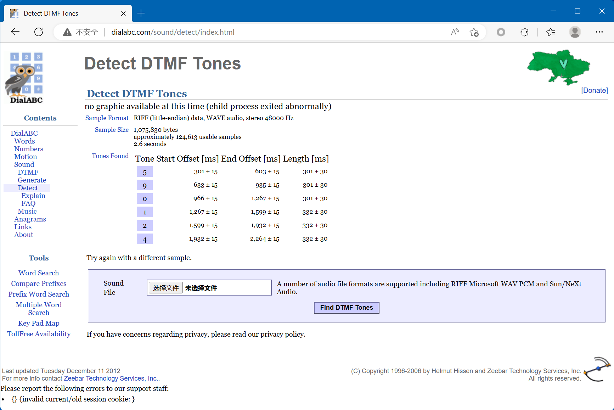
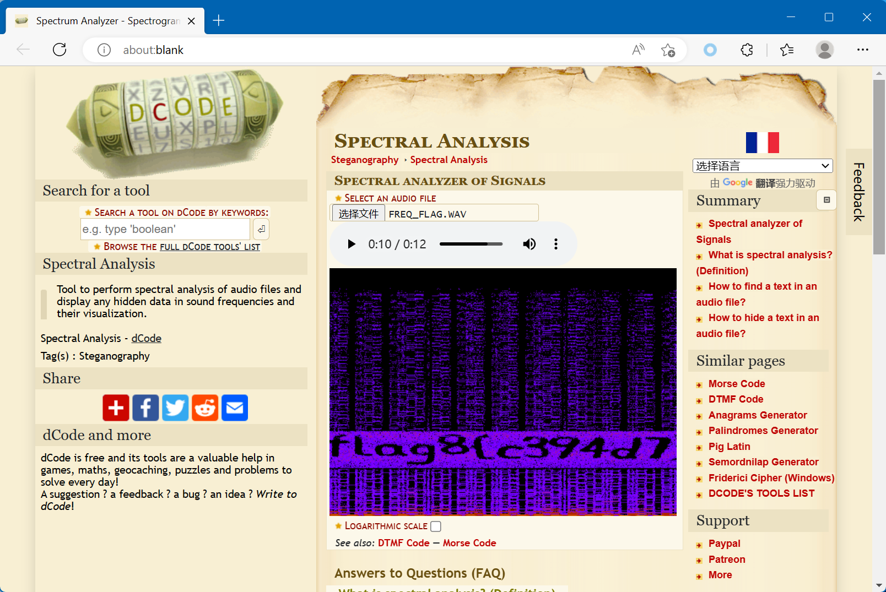
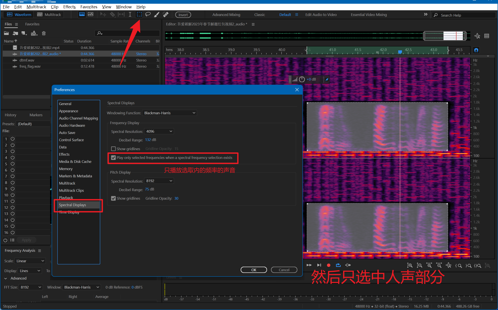
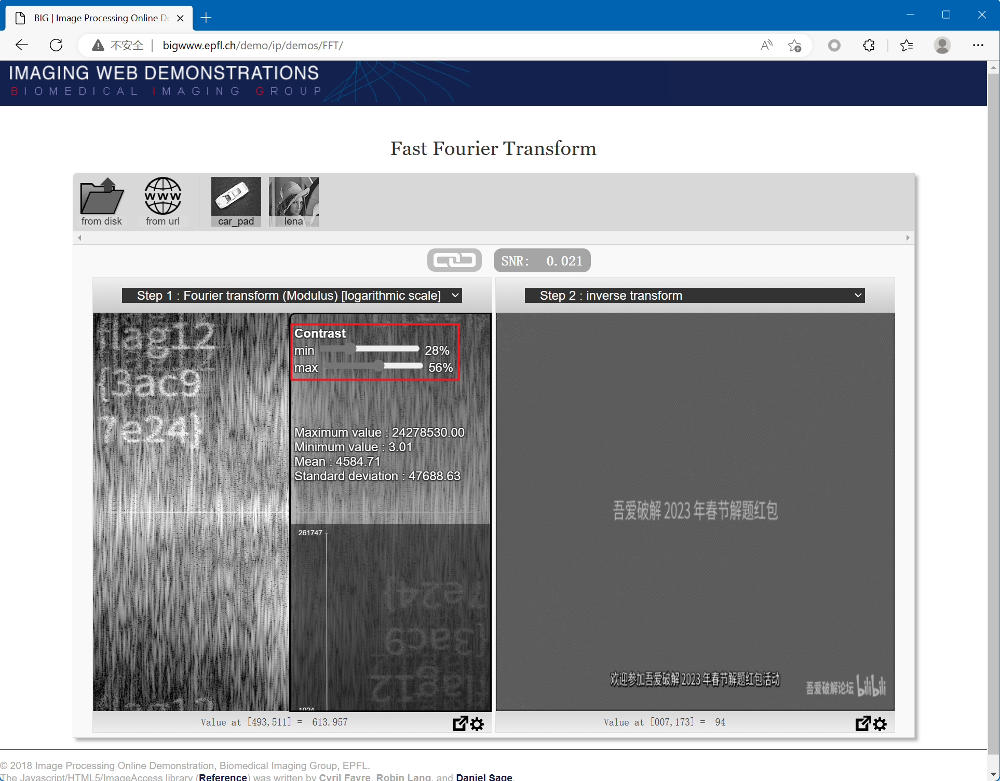
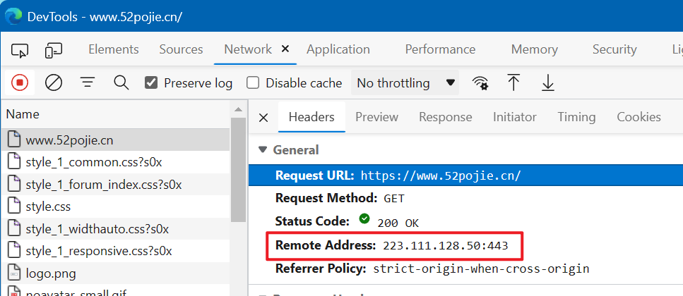
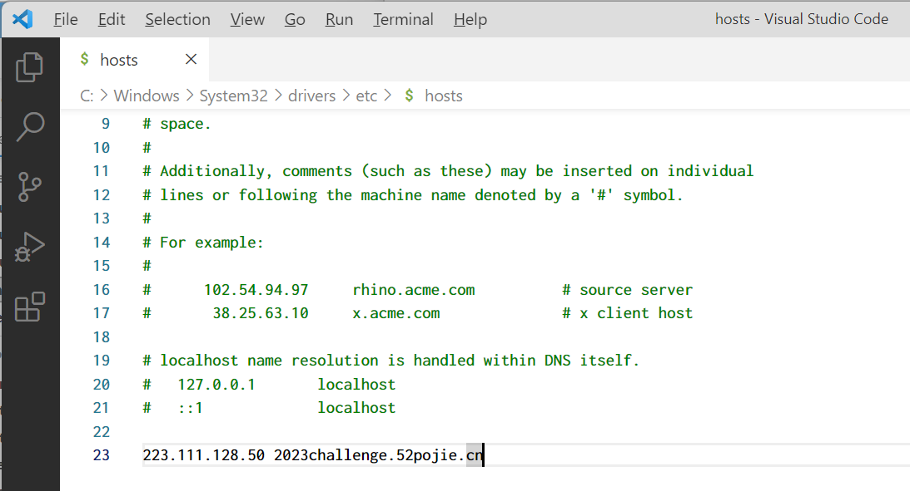
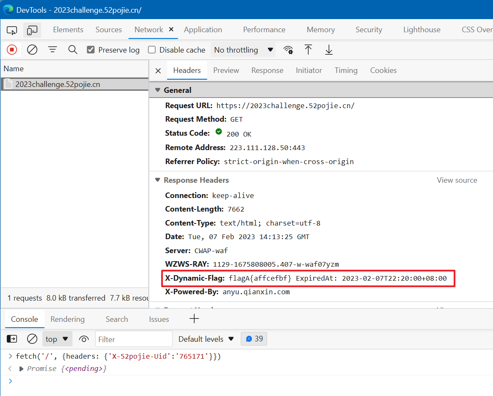
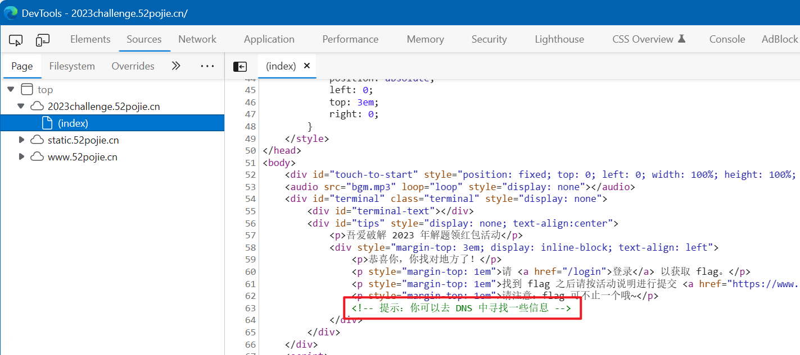

# 吾爱破解 2023 年春节解题红包视频解谜和 Web 题目出题思路

## 难度说明

首先，出题的目的是希望大家都能做出来的。要给大家一种“这里面肯定有问题”但是必须要探索一下才能发现的。

1. 简单题都是可以直接看到或听到的，经过常见编码的文字。
2. 中等题都是可以直接看到或听到的，但是需要经过解密或者进一步探索。
3. 困难题都是无法直接看到或听到的，或者需要经过处理才能看到或听到的。

这些题目是我所见过的一些有趣的知识点。因为不同人的知识面不同，一部分人觉得习以为常的东西，可能别人很难遇到。

题目做了一些冗余，并且所有题目都没有做成串行关系。每到题目都是独立的，串行关系的话可能有些人第一题没做出来的话，后续的题目的知识点完全碰不到。

其实看到不同人卡在不同题目上，但做出来的部分又可以互补，我对自己的题目很满意。

最开始设计的时候就是每个难度 4 个静态 flag + 1 个动态 flag，需要答上来 2 个静态 flag + 1 个动态 flag 算通过。后来 H 大跟我说第一天可以把难度拉满，后续再逐渐放开，这样设计玩法确实不错。

动态题目是为了一定程度上防止作弊，动态编码了时间和 UID。因为静态部分有冗余，但是动态没有冗余，所以动态没出得太复杂。

> 不要被吓到，当做猜灯谜就好了~

## 解题和出题思路

你要想办法通过这个视频找出类似于这样 flag1{52pojiehappynewyear} 的字符串，并将结果提交到这里 https://2023challenge.52pojie.cn/ 。

### flag1

首先第一个，直接明文已经给出来了 flag1{52pojiehappynewyear}，不要光以为这个是在“举例”，他就是 flag1。

这里我也想过做成再藏一个不同的 flag1，但是猜谜题目还是尽量不要做得太迷惑了。

### flag2

二维码和链接同时出现，并且二维码放在了链接旁边，但是我可没说这个二维码就是这个链接。

扫描之后可以看到链接实际上是 https://2023challenge.52pojie.cn/?flag=flag2{878a48f2} 多了一个 flag2。扫描打开了链接的时候，页面会自动重定向将 query 清除掉。

因为页面会自动重定向，我本来想将 X-Dynamic-Flag: flagA{Header X-52PoJie-Uid Not Found} 藏在这个重定向之前的页面的，但是我怕藏得太深了，没这么搞。

### flag3

视频右下角的“吾爱破解论坛 bilibili”水印是我自己叠加上去的，中间变化了一次 iodj3{06i95dig}，只有几秒钟。利用的就是这种心理，以为水印是 B 站自动加的。

标准恺撒密码，偏移量是 3，iodj3{06i95dig} -> flag3{06f95afd}。

它出现的时间点是我故意挑的。上方奇怪的 1010 数字出现一秒钟后，你的注意力大概率会被吸引过去，这时右下角的水印开始渐变。边框往下拓展时，水印再变回来。甚至我在自己编辑视频的时候也经常会忽略掉右下角的变化。

我很想调查一下，有多少人没有注意到这个 flag3，有多少人看了好几遍都没注意到 flag3。

### flag4

作者究竟是在什么精神状态下，能做出这种视频。不到一分钟的视频里藏了八百个心眼。难到不会想去调查一下视频作者。flag4 藏在作者签名里“快猜猜这个是什么 ZmxhZzR7OWNiOTExMTd9”。为了防止有人没有注意到签名，我最新的一条动态也写了这个密文。base64 解码之后就是 flag4{9cb91117}。


社会工程学也可以作为题目。

### flag5

这个没什么说的，摩尔斯电码。解码之后时 flag5{eait}。

我是使用这个网站生成的声音 https://morsecode.world/international/translator.html

我没有选择默认的 550Hz，也没有用默认的速度。我选择了比较清晰的 1000Hz 声音，还加长了字母之间的间隔。

应该不会有人专门去学过这个的吧，默认的滴答声真是太快了，我自己试了好几次都听不懂。我增加了每组的间隔，直到我自己可以做到不靠工具就能听出来，才确定下来。

我还专门选的是 e a i t 这种非常简单的编码，方便解码。

这里需要说的一点是，电视剧里能听到电报声只是一种“表示正在收发电报的方法”，实际上电报声音只能在电报员的耳机里听到，不带耳机听不到。

### flag6

这个在视频开头字幕就明确给出了，是一段手机拨号音，双音多频，可以对着自己的手机键盘一个一个试，然后听解出 flag6{590124}。

这个也是，我设计的标准也是，得能达到自己能不靠工具就解出来才行。

当然，解题的时候没有必要，人可以依靠工具嘛。当你打开 Audicity、GoldWave 或者 Audition 的话，你就中计了，因为大概率你会直接在声谱图上直接看到 flag8。

Bing 搜索 Online Spectral Visualize 可能会找到这个网站 http://dialabc.com/sound/detect/index.html ，可以自动识别 DTMF。



DTMF 实际上是还有 ABCD 四个字母的，但是为了部分人能不靠工具就解出来，所以我只选择了手机键盘上存在的 0-9。

我实在没想好怎样才能不明确给出 flag6 这个信息，所以最后只能在字幕上打出来了。

现在出生的小孩子或许从来都没有听过拨号音了吧。我不太清楚，有小孩子的可以去试试，可能有些“常识”正在消失。

声音是在 https://www.dcode.fr/dtmf-code 生成的。

### flag7

然后就是屏幕上面那一串数字，动画开始时是有空格的，然后空格会被消去。

```
01 1 001 1 001 1 01 1 0001 1 00001 01 1 001 1 1 001 1 0111 011 1 101100 1 1 0 10 1 011 0 01 0000 1 10000 001 1 01 1 0 011 0 00 10 011 0 010 100 1 1011 000 1 1 0 0 11 01111101
```

你肯定能注意到空格的分布比较奇怪，但是却不知道是什么情况。消去空格之后的 1010 串，二进制转换成 ASCII 之后就是 flag7{5d06be63}。

```
011001100110110001100001011001110011011101111011001101010110010000110000001101100110001001100101001101100011001101111101
```

可以去找在线解码的网站，比如 https://binarytotext.net/ ，也可以直接写点 js 来解码。

```javascript
console.log(
    Array.from('011001100110110001100001011001110011011101111011001101010110010000110000001101100110001001100101001101100011001101111101'.matchAll(/.{8}/g))
        .map((x) => x[0])
        .map((s) => parseInt(s, 2))
        .map((x) => String.fromCodePoint(x))
        .join('')
);
```

### flag8

把视频下载下来，查看声谱图，你可以直接看到 flag8{c394d7}。

可以通过 Audicity、GoldWave 或者 Audition 这类专业软件，也可以通过在线的 https://www.dcode.fr/spectral-analysis 看到声谱图。



最开始我想用全频率的白噪音作为背景，然后扣掉一部分频率，不过这个噪音太难听了。后来我发现，根本不需要全频率的噪音，只需要 5kHz ~ 8kHz 这一段频率就足够看清了，最开始我是用 0 ~ 20kHz 。

为了避免白噪音听着刺耳，我从网上找了一段 8bit 风格的音频 https://opengameart.org/content/8bit-title-screen ，听着感觉还不错，正好人耳对低频更敏感，可以缓解刺耳的感觉。

flag8 的字是我自己写上去的，选择的字母都是辨识度比较高的，数字 1 6 b 这种的就不能用。

### flag9

其实 flag9 也没什么难的，视频会听到最后的咒语，应该就会想到倒放了。

其实难度和上一道题没啥差别，上一道做出来的话，这一道应该也能做出来。把他放在高级题是因为“倒放”真的需要你去通过音频处理软件进行操作，频谱图则是有很多网站可以在线解析。

评论中有人说听不清 flag9，如果你可以把非人声部分的声音都静音的话，应该可以听见。并且我选择的数字字母的读音都是区分度比较高的。



### flag10

这个是唯一一个需要猜的吧，其实是利用上面的二进制字符串中间“是”或“否”存在空格代表 1 和 0。

使用下面这个脚本这样就可以转换成第 7 题的内容了。

```javascript
console.log(
    Array.from('01 1 001 1 001 1 01 1 0001 1 00001 01 1 001 1 1 001 1 0111 011 1 101100 1 1 0 10 1 011 0 01 0000 1 10000 001 1 01 1 0 011 0 00 10 011 0 010 100 1 1011 000 1 1 0 0 11 01111101'.matchAll(/. ?/g))
        .map((x) => x[0])
        .map((x) => x.length - 1)
        .join('')
);
```

然后就能解出 flag10{4a752b} 了。

这是我生成密文的代码

```javascript
const mergeString = (s1, s2) => {
    if (s1.length < s2.length) {
        throw new Error('s1.length < s2.length');
    }
    return s1.split('').map((ch, i) => `${ch}${s2.charAt(i)}`).join('');
}
flag7 = 'flag7{5d06be63}'.split('').map(ch => ch.codePointAt(0).toString(2).padStart(8, '0')).join('');
flag10 = 'flag10{4a752b}'.split('').map(ch => ch.codePointAt(0).toString(2).padStart(8, '0')).join('');
mergedFlag = mergeString(flag7, flag10.replaceAll('0', 'A').replaceAll('1', ' ')).replaceAll('A', '');
// flag7 = '011001100110110001100001011001110011011101111011001101010110010000110000001101100110001001100101001101100011001101111101';
// flag10 = '0110011001101100011000010110011100110001001100000111101100110100011000010011011100110101001100100110001001111101';
// mergedFlag = '01 1 001 1 001 1 01 1 0001 1 00001 01 1 001 1 1 001 1 0111 011 1 101100 1 1 0 10 1 011 0 01 0000 1 10000 001 1 01 1 0 011 0 00 10 011 0 010 100 1 1011 000 1 1 0 0 11 01111101';
```

另外我想过用 `\u200b` 这个“零宽空格”而不是普通空格来藏。直接查看源代码的话部分编辑器完全看不到这个字符，我怕提示不够所以没这么搞。

公司可能给不同员工发送的“全员”邮件中的标点符号、“的地得”会不一样。里面可能会隐藏一些信息，需要注意哦。一个公司就顶多就几万名员工，只需要 10~20bit 就足够追溯到每个人了。

### flag11

Brainfuck 解码，知道这个的话肯定可以秒解 flag11{63418de7}

```
++++++++++[>++++++++++>++++++++++>+++++>++++++++++++<<<<-]>++.++++++.>---.<-----.>>-..>+++.<+++++.---.+.---.+++++++.<+++.+.>-.>++.
```

可以使用 https://ctf.bugku.com/tool/brainfuck 或者 https://tnu.me/brainfuck 来解码。

我是用 https://tnu.me/brainfuck/generator 生成的。

Brainfuck 是一个图灵完全的语言，他支持输入输出，支持加法减法，支持左右移动指针寻址，支持条件循环，在内存无限的前提下，可以完成根据输入内容执行程序运算并输出。

其实 flag10 的思想来自与 Brainfuck 的一个变种。Brainfuck 有 8 种字符。可以用 Tab 或空格表示 0 或 1，每 3 个一组，每组有 2 ^ 3 = 8 种字符。不过这个没有什么标准，不给提示的话没法解。

WhiteSpace 也是一种语言，这种都是可以成为嵌在一份代码中的另一份代码。

### flag12

这个就是频域水印了，你只需要在 http://bigwww.epfl.ch/demo/ip/demos/FFT/ 网站，导入任意一张视频截图，即可看到 flag12{3ac97e24} 了。




频域水印牛逼的一点就在于，以任意方式截图，总能看到水印信息。无论是裁切、拉伸、旋转、乱涂乱画、亮度、对比度、曲线、半透明叠加都没用，想去除频域水印必须针对全部像素进行处理。

我在视频中使用的是 512x512 的水印图，直接拉伸到 1920x1080，并以 20% 的透明度放在视频最上面一个图层，就可以得到这种效果。

正常来说频域水印应该是难以察觉的。不过这个 flag 字符串的图片需要携带的信息太多了，还要为了防止 b 站视频二压变糊，水印加的强度比较高，画面会有明显的波纹。

发出去之后，我自己验证了，360P 的视频都能解出来。只有最高频的部分强度变低了，不影响 flag12 的获取。

一般公司内部的盲水印 RGB 每个通道应该不会超过正负 2。因为携带的信息是都是的二进制信息，加在低频部分，不需要很高的强度就有抗干扰性了，应对 jpg 这类有损压缩足够了。这种截图可以溯源，拍屏肯定不够溯源，一般需要靠明水印和盲水印配合。

想去具体了解的话可以去看这篇知乎 https://www.zhihu.com/question/50735753

### flagA

首先先修复 DNS，修改一下 hosts，添加一条记录。





访问 https://2023challenge.52pojie.cn/ 的 Response Header 中会提示 `X-Dynamic-Flag: flagA{Header X-52PoJie-Uid Not Found}`

如果在 Request Header 中添加一个 `X-52PoJie-Uid: 765171`，则 Response Header 中会提示 `X-Dynamic-Flag: flagA{ef7cd303} ExpiredAt: 2023-02-07T03:40:00+08:00`

我是直接使用 js 的 Fetch API 来发送协议的。fetch 之后就可以在 Network 中看到的这个新请求了。

```javascript
fetch('/', {headers: {'X-52pojie-Uid':'765171'}})
```



### flagB



DNS 中有一个 TXT 记录

```plain
_52pojie_2023_happy_new_year=flagB{substr(md5(uid+"_happy_new_year_"+floor(timestamp/600)),0,8)}
```

可以通过在线 nslookup 查看 https://www.nslookup.io/domains/2023challenge.52pojie.cn/

### flagC

请输入你的 UID: 这个输入框被设置为 disable 了，F12 去掉。

然后 Cookies 中有一个 jwt。

在 https://jwt.io/ 把 `"role":"user"` 改成 `"role":"admin"`，然后把新的 jwt 放回 Cookie 中。刷新页面，就可以在页面中看到了。

服务端使用 jwt 必须校验签名，不校验签名的话，完全没有任何安全性。

### 其他有趣的事情

有人尝试在 b 站私信我“flag”，以为我做了什么自动回复机器人，不过并没有。

有人私信我“视频三连了有没有 flag”，b 站没法批量获取或者检测谁给视频三连了。

视频评论区是精选的，这个是为了防止有人直接把答案发出来。

### 隐藏问题

这次提交答案的校验代码，后来我自己发现代码里的一个 bug。

```php
function verify_key_2023_ganlv_flag($flag, $uid, $timestamp, $dynamic_flag_name, $dynamic_secret, $static_flags, $need_static_flag_count) {
    $dynamic_flag = $dynamic_flag_name . '{' . substr(md5($uid . $dynamic_secret . floor($timestamp / 600)), 0, 8) . '}';
    echo $dynamic_flag, ' ';
    if (false === strpos($flag, $dynamic_flag)) {
        return false;
    }
    $found_static_flag = 0;
    foreach ($static_flags as $static_flag) {
        if (false !== strpos($flag, $static_flag)) {
            $found_static_flag++;
        }
    }
    if ($found_static_flag < $need_static_flag_count) {
        return false;
    }
    return true;
}

verify_key_2023_ganlv_flag($_POST['code'], $uid, time(), 'flagB', '_happy_new_year_', ['flag5{eait}', 'flag6{590124}', 'flag7{5d06be63}', 'flag8{c394d7}'], 2);
```

里面的 strpos 可以穷举，比如 flag6 我听不出来是什么，但是我知道是 6 位数字，那么就直接填写

```plain
flag6{000000} flag6{000001} flag6{000002} flag6{000003} flag6{000004} ...
```

只要有一个能对上就行了。

## 关于题目类型

大部分都是 misc 乱七八糟的题目，因为我想搞一种比较新的形式。希望大家做这些题的时候每一步都有惊喜，都能发现新东西。如果你因为这些题目对某个知识产生了兴趣，那么目的就达到了。

我没有出 js 解密的题，因为我对这部分的市场现状不熟悉，我怕随便搞得太偏，然后还没有什么通用的价值。之后可以尝试一下，可能会有一些有趣的东西。

我很想搞服务端的代码漏洞那种题，不过这种题很难设计。一种是提供代码，白盒分析漏洞，对这个语言熟悉的人可能就秒解，不熟悉的人都不知道啥问题。另一种是不提供源码，全靠猜，要提示到位，别浪费大家的时间瞎猜，又不能说的太明白，要不直接就在网上找到现成的“押题卷”了。也不能搞 SQL 注入，这种东西对服务器有风险。总之，能出的题型太有限了。

现实中这种漏洞一般都是语言的“特性”，一些刚接触这门语言的程序员会写出这类问题，并且完全不会察觉，你即使告诉他这行代码有问题他都不知道问题是什么。

不要觉得这很不可思议，我工作中的小组，绝大多数都是没有专门学过 Go 语言的，比如从 Java 转 Go 的，没有系统学习过 Go 语言和一些常用库，不小心写出漏洞真的太容易了。

即使我写了很多年代码了，依然会出问题，比如上面那个 strpos 的漏洞。

## 结语

非常感谢大家的关注与支持，祝大家在新的一年里能学到更多的新知识，学习进步、工作顺利。
